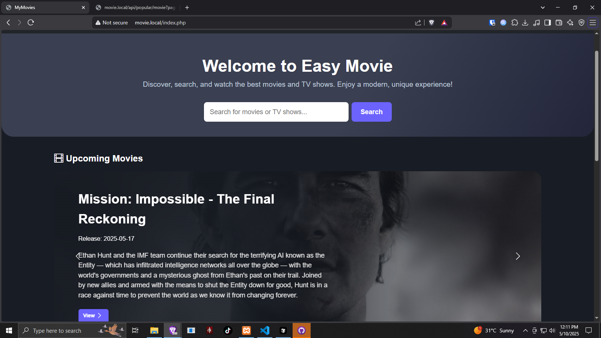
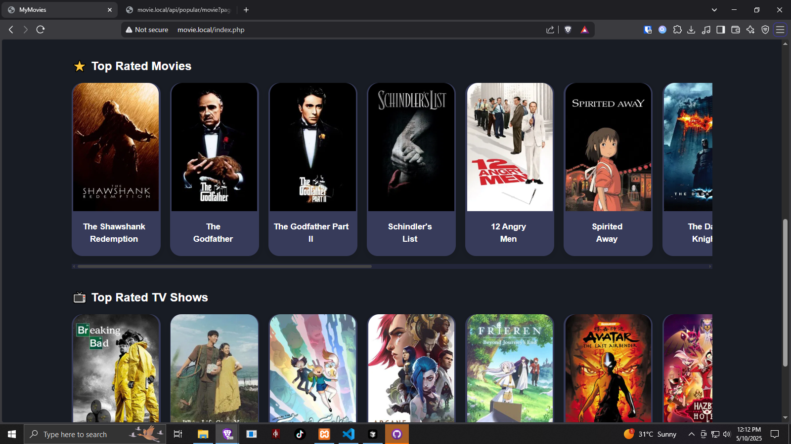
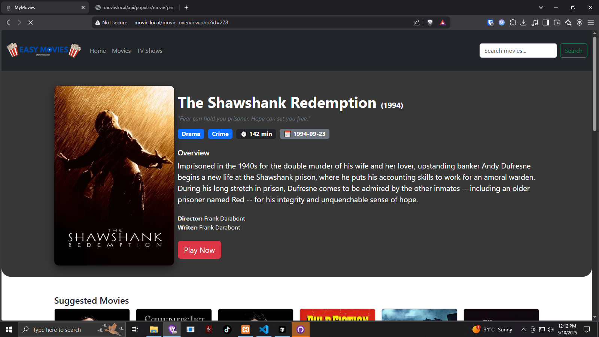
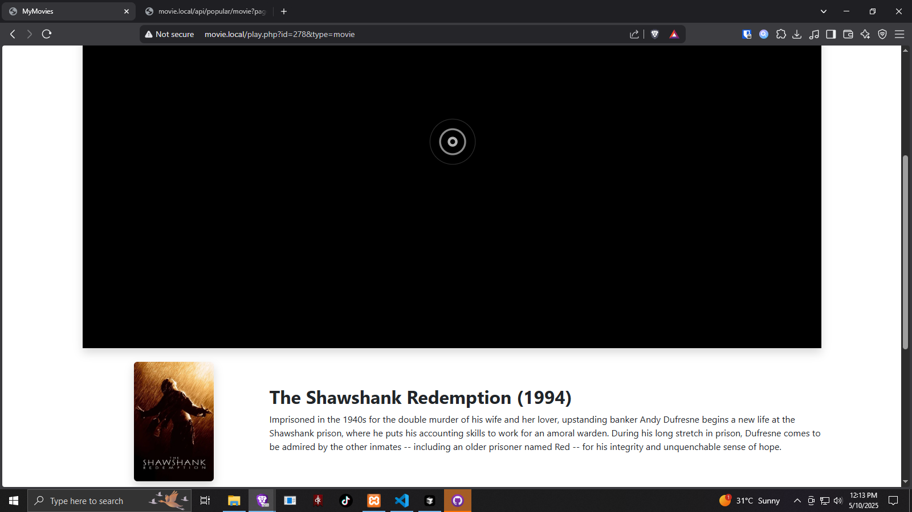

# Easy Movie - Movie Streaming Platform

A modern web application for streaming movies and TV shows, built with PHP and TMDB API.



## Features

- 🎬 Browse popular movies and TV shows
- 🔍 Search functionality
- 📺 Watch movies and TV shows
- 🎯 Similar content recommendations
- 📱 Responsive design
- 🎨 Modern UI/UX

## Screenshots

### Movie Details


### TV Shows


### Search Results


## Technologies Used

- PHP 8.2
- MySQL
- TMDB API
- Bootstrap 5
- JavaScript (ES6+)
- HTML5/CSS3

## Installation

1. Clone the repository:
```bash
git clone https://github.com/yourusername/easy-movie.git
```

2. Set up your web server (XAMPP/WAMP):
- Place the project in your web server's root directory
- Configure your virtual host (if needed)

3. Configure the database:
- Create a new database
- Import the database schema (if provided)

4. Configure API:
- Get your TMDB API key from [TMDB](https://www.themoviedb.org/documentation/api)
- Update the API key in `api/tmdb.php`

5. Set up virtual host (optional):
```apache
<VirtualHost *:80>
    ServerAdmin webmaster@localhost
    DocumentRoot "C:/xampp/htdocs/easy-movie"
    ServerName movie.local

    <Directory "C:/xampp/htdocs/easy-movie">
        Options Indexes FollowSymLinks
        AllowOverride All
        Require all granted
    </Directory>

    ErrorLog "logs/movie-error.log"
    CustomLog "logs/movie-access.log" common
</VirtualHost>
```

## Project Structure

```
easy-movie/
├── api/
│   ├── config.php
│   ├── credits.php
│   ├── movie.php
│   ├── popular.php
│   ├── search.php
│   ├── similar.php
│   ├── tmdb.php
│   └── tv.php
├── assets/
│   ├── css/
│   ├── js/
│   └── image/
├── includes/
│   ├── header.php
│   └── footer.php
├── index.php
├── movie.php
├── movie_overview.php
├── play.php
├── search.php
├── tv.php
└── tv_overview.php
```

## API Endpoints

- `/api/movie/{id}` - Get movie details
- `/api/tv/{id}` - Get TV show details
- `/api/similar/{id}` - Get similar content
- `/api/popular/{type}` - Get popular content
- `/api/search` - Search content
- `/api/credits/{id}` - Get credits

## Features

- **Movie Browsing**: Browse through popular movies with pagination
- **TV Shows**: Access popular TV shows
- **Search**: Search for movies and TV shows
- **Details View**: View detailed information about movies and TV shows
- **Similar Content**: Get recommendations based on current content
- **Responsive Design**: Works on all devices
- **Modern UI**: Clean and intuitive interface

## Contributing

1. Fork the repository
2. Create your feature branch (`git checkout -b feature/AmazingFeature`)
3. Commit your changes (`git commit -m 'Add some AmazingFeature'`)
4. Push to the branch (`git push origin feature/AmazingFeature`)
5. Open a Pull Request

## License

This project is licensed under the MIT License - see the LICENSE file for details

## Credits

- Design and Develop By **ISOY**
- Movie data provided by [TMDB](https://www.themoviedb.org/)
- Icons by [Bootstrap Icons](https://icons.getbootstrap.com/)

## Contact

Your Name - [@yourtwitter](https://twitter.com/yourtwitter)

Project Link: [https://github.com/yourusername/easy-movie](https://github.com/yourusername/easy-movie)